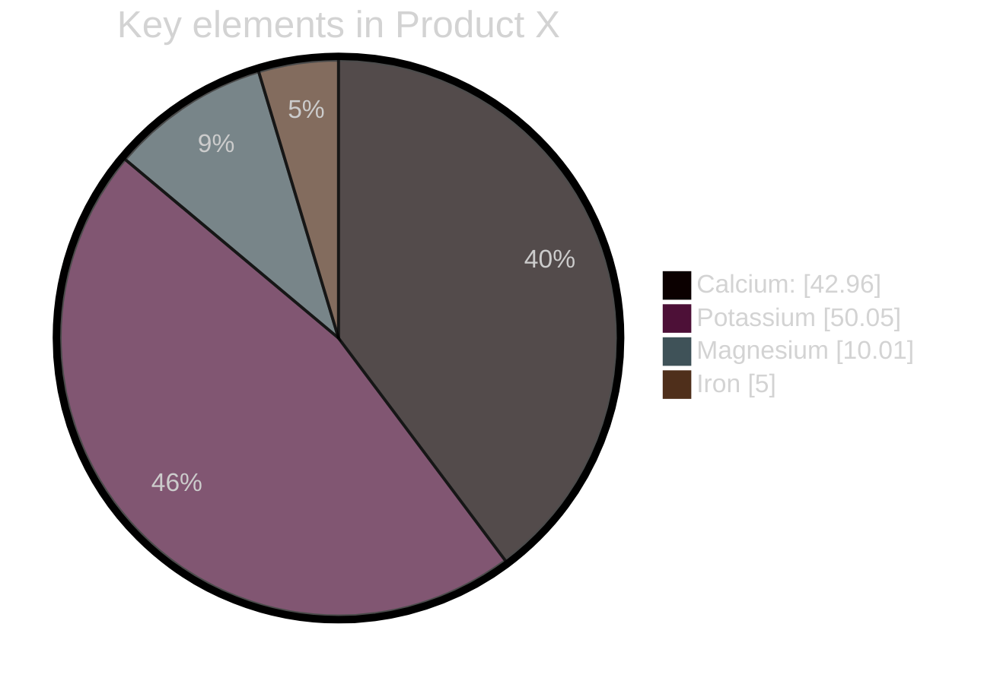

```mermaid
---
config:
  theme: 'dark'
  themeVariables: 
    pieOuterStrokeWidth: "1px"
---
%%{init: {"pie": {"textPosition": 0.8}, "themeVariables": {"pieOuterStrokeWidth": "5px"}} }%%
pie showData title Pets adopted by volunteers
	%% pie: test
    title Key elements in Product X
    "Calcium:" : 42.96
    "Potassium" : 50.05
    "Magnesium" : 10.01
    "Iron" :  5
```

