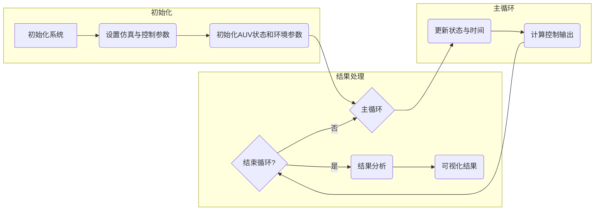

```mermaid
graph LR
   subgraph 结果处理
        G -->|否| D
        G -->|是| H(结果分析)
        H --> I(可视化结果)
    end
    
    subgraph 初始化
        A[初始化系统] --> B(设置仿真与控制参数)
        B --> C(初始化AUV状态和环境参数)
    end

    subgraph 主循环
        D{主循环} --> E(更新状态与时间)
        E --> F(计算控制输出)
        F --> G{结束循环?}
    end

 

    C --> D
```

