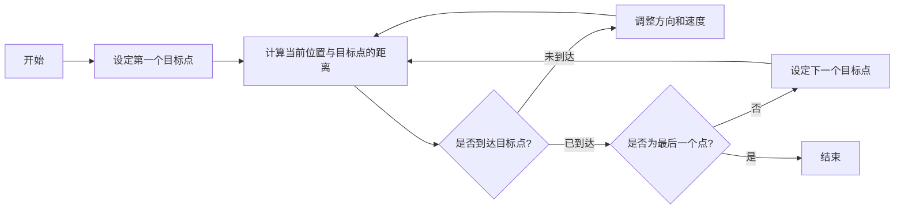
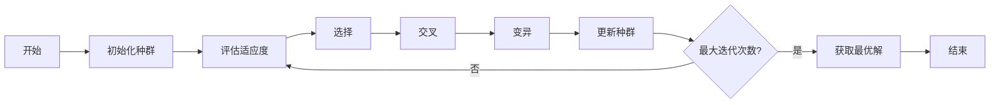

有一艘船在水面上运动，它的目的是沿着一条航路行驶。这条航路由n个点构成，船必须经过每个点，距离每个点的最大误差为e。给出一个优化方案，重新计算n个点，使得行驶的距离最短，且满足误差要求。

这个问题可以视为一个路径优化问题，目标是在满足每个点的最大误差要求的前提下，找到一条最短的路径。我们可以使用优化算法来解决这个问题。常见的优化算法包括遗传算法、粒子群优化、模拟退火等。这里我们使用遗传算法（Genetic Algorithm, GA）来实现。

### 优化目标函数

假设航路由 $n$ 个点组成，记为 $\mathbf{P} = [P_1, P_2, \ldots, P_n]$，其中每个点 $P_i = (x_i, y_i)$。我们需要找到一个新的路径 $\mathbf{Q} = [Q_1, Q_2, \ldots, Q_m]$，使得：

1. 每个点 $P_i$ 与路径 $\mathbf{Q}$ 上的某个点 $Q_j$ 之间的距离不超过最大误差 $e$。
2. 路径 $\mathbf{Q}$ 的总长度最短。

### 优化目标函数

定义路径 $\mathbf{Q}$ 的总长度为：

$ L(\mathbf{Q}) = \sum_{j=1}^{m-1} \|Q_j - Q_{j+1}\| $

其中，$\|Q_j - Q_{j+1}\|$ 表示点 $Q_j$ 和点 $Q_{j+1}$ 之间的欧几里得距离。

### 约束条件

对于每个点 $P_i$，存在一个点 $Q_j$ 使得：

$ \|P_i - Q_j\| \leq e $

### 遗传算法实现

遗传算法的主要步骤包括初始化种群、选择、交叉、变异和评估。以下是使用Matlab实现的遗传算法代码：

```matlab
function [optimized_path, total_distance] = optimize_path(P, e, pop_size, max_gen, mutation_rate)
    % P: 原始航路点 [n x 2]
    % e: 最大误差
    % pop_size: 种群大小
    % max_gen: 最大迭代次数
    % mutation_rate: 变异率

    n = size(P, 1);
    m = n; % 假设优化后的路径点数与原始点数相同

    % 初始化种群
    population = init_population(pop_size, n, m);

    % 主循环
    for gen = 1:max_gen
        % 评估适应度
        fitness = evaluate_fitness(population, P, e);
        
        % 选择
        selected_population = selection(population, fitness, pop_size);
        
        % 交叉
        crossed_population = crossover(selected_population, pop_size);
        
        % 变异
        mutated_population = mutation(crossed_population, mutation_rate);
        
        % 更新种群
        population = mutated_population;
    end

    % 获取最优解
    [best_fitness, best_idx] = max(fitness);
    optimized_path = population(best_idx, :);
    total_distance = path_length(optimized_path);

    % 初始化种群
    function pop = init_population(pop_size, n, m)
        pop = zeros(pop_size, m, 2);
        for i = 1:pop_size
            pop(i, :, :) = P(randperm(n, m), :);
        end
    end

    % 评估适应度
    function fit = evaluate_fitness(population, P, e)
        fit = zeros(size(population, 1), 1);
        for i = 1:size(population, 1)
            path = population(i, :, :);
            if is_feasible(path, P, e)
                fit(i) = 1 / path_length(path);
            else
                fit(i) = 0;
            end
        end
    end

    % 检查可行性
    function feasible = is_feasible(path, P, e)
        feasible = true;
        for i = 1:size(P, 1)
            min_dist = min(sqrt(sum((path - P(i, :)).^2, 2)));
            if min_dist > e
                feasible = false;
                return;
            end
        end
    end

    % 选择
    function selected_pop = selection(population, fitness, pop_size)
        probabilities = fitness / sum(fitness);
        selected_pop = population(randsample(pop_size, pop_size, true, probabilities), :, :);
    end

    % 交叉
    function crossed_pop = crossover(selected_pop, pop_size)
        crossed_pop = zeros(pop_size, size(selected_pop, 2), 2);
        for i = 1:2:pop_size
            parent1 = selected_pop(i, :, :);
            parent2 = selected_pop(i+1, :, :);
            crossover_point = randi([1, size(parent1, 1)-1]);
            child1 = [parent1(1:crossover_point, :); parent2(crossover_point+1:end, :)];
            child2 = [parent2(1:crossover_point, :); parent1(crossover_point+1:end, :)];
            crossed_pop(i, :, :) = child1;
            crossed_pop(i+1, :, :) = child2;
        end
    end

    % 变异
    function mutated_pop = mutation(crossed_pop, mutation_rate)
        mutated_pop = crossed_pop;
        for i = 1:size(mutated_pop, 1)
            if rand < mutation_rate
                idx1 = randi([1, size(mutated_pop, 2)]);
                idx2 = randi([1, size(mutated_pop, 2)]);
                temp = mutated_pop(i, idx1, :);
                mutated_pop(i, idx1, :) = mutated_pop(i, idx2, :);
                mutated_pop(i, idx2, :) = temp;
            end
        end
    end

    % 计算路径长度
    function dist = path_length(path)
        dist = 0;
        for i = 1:size(path, 1)-1
            dist = dist + norm(path(i, :) - path(i+1, :));
        end
    end
end
```

### 代码说明

1. **初始化种群**：随机生成初始路径。
2. **评估适应度**：计算每个路径的适应度，即路径长度的倒数。如果路径不可行（即某些点的距离超过最大误差），适应度为0。
3. **选择**：根据适应度选择下一代个体。
4. **交叉**：通过交叉操作生成新的个体。
5. **变异**：通过变异操作引入多样性。
6. **更新种群**：用新生成的个体替换旧的种群。
7. **获取最优解**：在所有迭代结束后，选择适应度最高的路径作为最优解。




