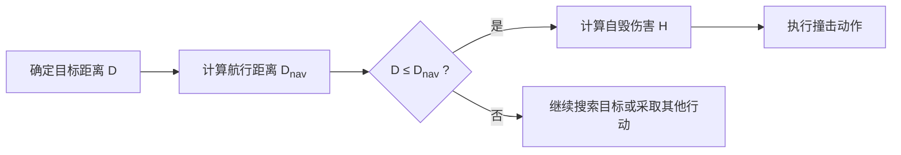

# 自毁撞击特性实现步骤

为了设计一个装备自毁撞击特性的损伤计算模型，我们需要考虑几个关键因素：剩余油量、最大速度、航行距离以及与目标的距离。下面是一个简化的模型框架，它假设装备一旦决定撞击目标，就会以最大速度直线向目标移动，并且在撞击时造成一定的伤害值。模型中还考虑了剩余油量对航行距离的影响。

## 模型假设

1. **装备的最大速度** $v_{max}$ 是已知的。
2. **装备的剩余油量** $F$ 以当前油箱容量的比例表示，例如满油时 $F = 1.0$，完全空油时 $F = 0.0$。
3. **装备的油耗率** $R$ 表示每单位时间消耗的油量比例。
4. **装备的初始位置** 和 **目标位置** 已知，可以计算出两者之间的距离 $D$。
5. **装备的自毁伤害** $H$ 可以根据其剩余油量和速度来计算。

## 模型公式

1. **航行距离** $D_{nav}$ 可以通过剩余油量和油耗率来估算：
   $$
   D_{nav} = \frac{F}{R} \cdot v_{max}
   $$

2. **是否触发自毁撞击**：当目标距离 $D \leq D_{nav}$ 时，装备将启动自毁程序，以最大速度 $v_{max}$ 向目标加速行驶。

3. **自毁伤害** $H$ 计算：
   $$
   H = k_1 \cdot v_{max} + k_2 \cdot F
   $$

## 实现步骤

