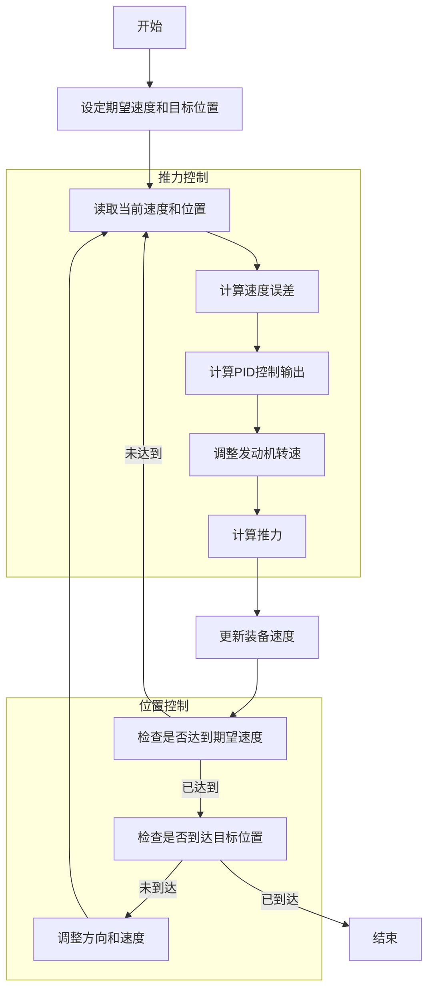

```mermaid
graph 
    subgraph "推力控制"
        C --> D[计算速度误差]
        D --> E[计算PID控制输出]
        E --> F[调整发动机转速]
        F --> G[计算推力]
    end
    subgraph "位置控制"
        K --> C
        I -->|已达到| J[检查是否到达目标位置]
    end

    A[开始] --> B[设定期望速度和目标位置]
    B --> C[读取当前速度和位置]
    G --> H[更新装备速度]
    H --> I[检查是否达到期望速度]
    I -->|未达到| C
    J -->|未到达| K[调整方向和速度]
    J -->|已到达| L[结束]
```

