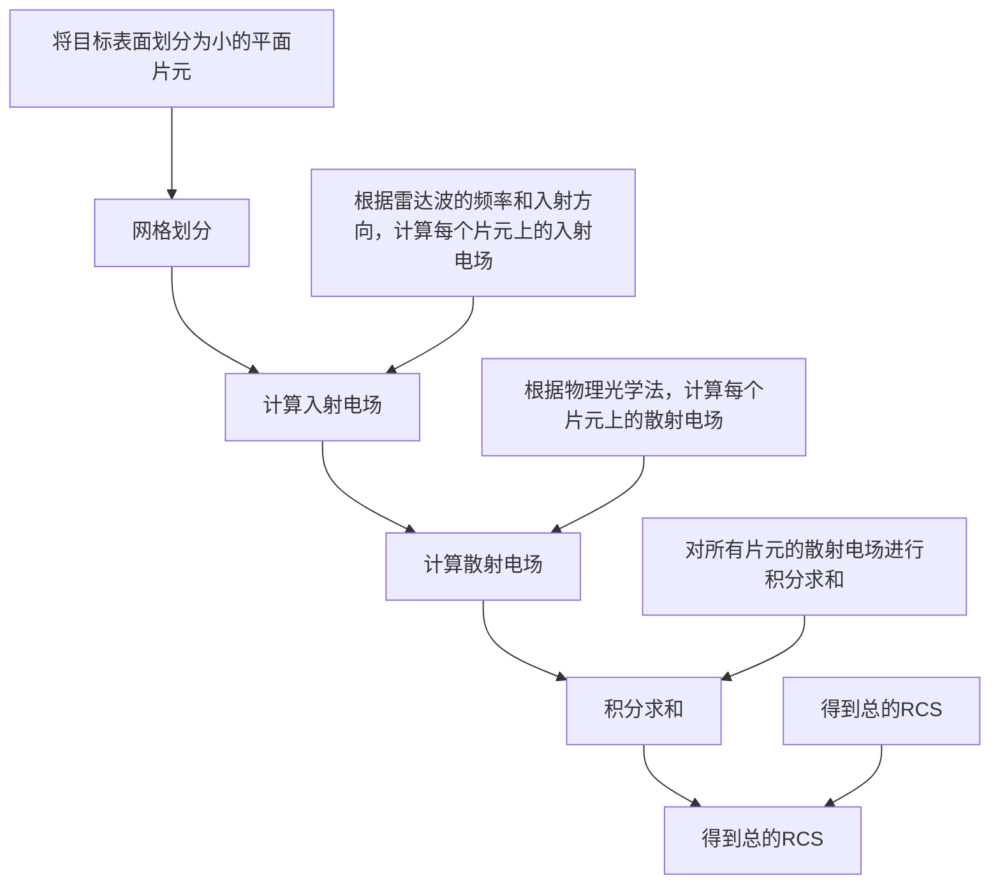
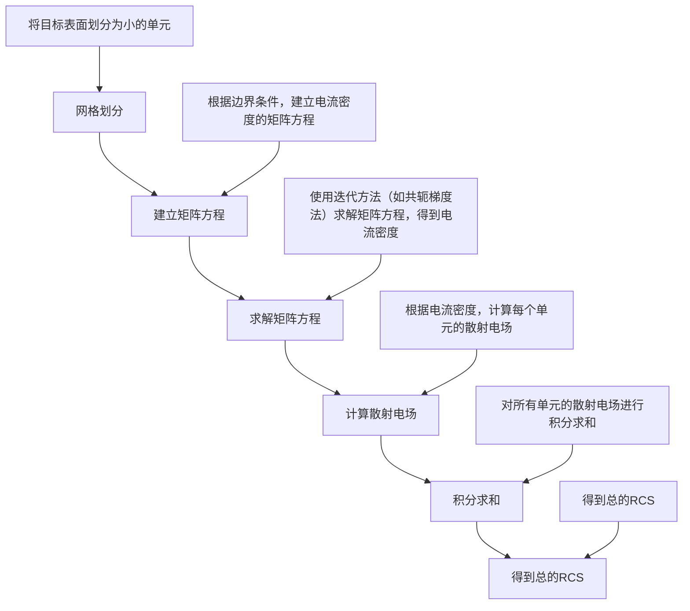

雷达截面积（Radar Cross Section, RCS）是描述目标对雷达波反射特性的参数。RCS的计算通常涉及复杂的电磁场理论和数值方法。以下是一个基本的RCS参数模型，支持在不同频率和不同姿态角度下的数值匹配。

### RCS 参数模型

#### 1. 基本概念
RCS定义为单位面积的目标在单位立体角内反射的雷达波功率与入射到目标上的雷达波功率之比。数学上，RCS可以表示为：
$ \sigma(\theta, \phi, f) $
其中：

- $\theta$ 是入射角（俯仰角）
- $\phi$ 是方位角
- $f$ 是雷达波的频率

#### 2. 数字化计算方法
RCS的计算通常使用数值方法，如物理光学法（Physical Optics, PO）、方法时刻法（Method of Moments, MoM）或有限元法（Finite Element Method, FEM）。这里我们使用一个简化的模型来说明如何进行数值计算。

### 2.1 物理光学法（PO）
物理光学法适用于高频情况下的大型目标。假设目标表面是平滑的，可以近似为镜面反射。

#### 2.1.1 基本公式
$ \sigma(\theta, \phi, f) = \left| \int_S \left( \mathbf{E}_i \times \mathbf{n} \right) \cdot \left( \mathbf{E}_s \times \mathbf{n} \right) dS \right| $
其中：

- $\mathbf{E}_i$ 是入射电场
- $\mathbf{E}_s$ 是散射电场
- $\mathbf{n}$ 是表面法向量
- $S$ 是目标表面

#### 2.1.2 数值计算步骤
1. **网格划分**：将目标表面划分为小的平面片元。
2. **计算入射电场**：根据雷达波的频率和入射方向，计算每个片元上的入射电场。
3. **计算散射电场**：根据物理光学法，计算每个片元上的散射电场。
4. **积分求和**：对所有片元的散射电场进行积分求和，得到总的RCS。




### 2.2 方法时刻法（MoM）
方法时刻法适用于任意形状的目标，尤其是具有复杂几何结构的目标。

#### 2.2.1 基本公式
$ \sigma(\theta, \phi, f) = \frac{4\pi}{k^2} \left| \int_S \mathbf{J}(\mathbf{r}) \cdot \mathbf{E}_s^*(\mathbf{r}) dS \right|^2 $
其中：

- $\mathbf{J}(\mathbf{r})$ 是电流密度
- $\mathbf{E}_s^*(\mathbf{r})$ 是散射电场的共轭
- $k = 2\pi f / c$ 是波数
- $c$ 是光速

#### 2.2.2 数值计算步骤
1. **网格划分**：将目标表面划分为小的单元。
2. **建立矩阵方程**：根据边界条件，建立电流密度的矩阵方程。
3. **求解矩阵方程**：使用迭代方法（如共轭梯度法）求解矩阵方程，得到电流密度。
4. **计算散射电场**：根据电流密度，计算每个单元的散射电场。
5. **积分求和**：对所有单元的散射电场进行积分求和，得到总的RCS。



### 3. 数值计算示例
假设我们有一个简单的平面目标，使用物理光学法进行RCS计算。

#### 3.1 目标参数
- **目标尺寸**：10 m x 10 m
- **雷达波频率**：1 GHz
- **入射角**：$\theta = 30^\circ$, $\phi = 45^\circ$

#### 3.2 计算步骤
1. **网格划分**：将目标表面划分为100个1 m x 1 m的小片元。
2. **计算入射电场**：根据雷达波的频率和入射方向，计算每个片元上的入射电场。
3. **计算散射电场**：根据物理光学法，计算每个片元上的散射电场。
4. **积分求和**：对所有片元的散射电场进行积分求和，得到总的RCS。

#### 3.3 Matlab代码示例
```matlab
% 参数设置
frequency = 1e9;  % 1 GHz
wavelength = 3e8 / frequency;  % 波长
k = 2 * pi / wavelength;  % 波数
theta = deg2rad(30);  % 俯仰角
phi = deg2rad(45);  % 方位角

% 目标参数
L = 10;  % 目标边长
N = 10;  % 网格数量
dx = L / N;  % 网格大小

% 网格划分
[x, y] = meshgrid(linspace(-L/2, L/2, N));

% 入射电场
E_i = exp(1i * k * (x .* sin(theta) .* cos(phi) + y .* sin(theta) .* sin(phi)));

% 散射电场
E_s = conj(E_i);

% 计算RCS
RCS = abs(sum(sum(E_i .* E_s * dx^2))) * (4 * pi / k^2);

fprintf('RCS at θ=%.2f°, φ=%.2f°, f=%.2f MHz: %.2f m²\n', rad2deg(theta), rad2deg(phi), frequency/1e6, RCS);
```

### 4. 结论
RCS的计算涉及复杂的电磁场理论和数值方法。物理光学法和方法时刻法是常用的数值计算方法。通过上述步骤和示例代码，可以对不同频率和不同姿态角度下的RCS进行数值匹配。